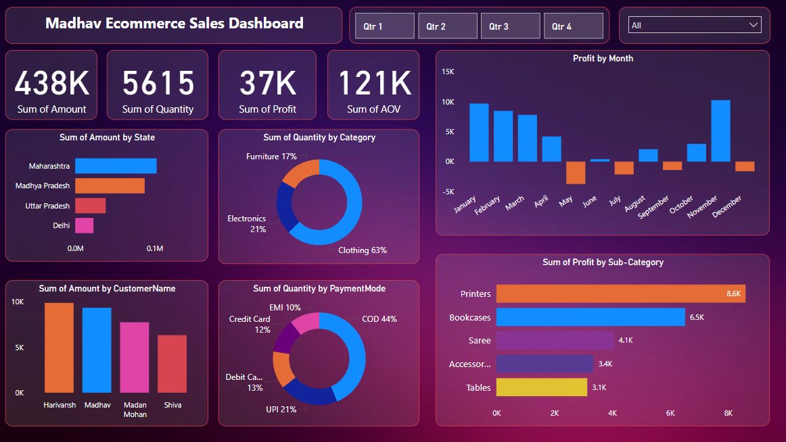

# 🛍️ Madhav E-commerce Sales Dashboard

A comprehensive Power BI dashboard project created to analyze the sales performance of a fictional e-commerce business — **Madhav E-commerce**. This project leverages Excel data and visual storytelling to deliver actionable business insights.

---

## 📊 Project Overview

This Power BI dashboard helps stakeholders answer key business questions such as:
- What are the sales and profit trends across different regions and products?
- Who are the top-performing customers and sales channels?
- Which categories generate the most revenue and profit?
- How is the business performing month-over-month and year-over-year?

---

## 📁 Files Included

| File | Description |
|------|-------------|
| Madhav Ecommerce Sales Dashboard.pbix | Power BI dashboard file |
| Madhav_Ecommerce_Sales_Data.xlsx | Cleaned and structured e-commerce sales dataset used for analysis |

---

## 📌 Key Features

- **Interactive Visuals**: Slicers for dynamic filtering (Region, Segment, Date)
- **KPI Cards**: Revenue, Profit, Quantity Sold, Orders
- **Trend Analysis**: Monthly Sales & Profit trend lines
- **Top Performers**: Best-selling products and top customer segments
- **Category Analysis**: Category-wise contribution to revenue and profit
- **Geographical Mapping**: Regional sales performance (if geo data available)

---

## 📈 Dashboard Snapshots

> 

---

## 🛠️ Tools Used

- **Power BI Desktop**
- **Microsoft Excel**
- **DAX (Data Analysis Expressions)**

---

## 📚 Learning Objectives

- Practice end-to-end data visualization workflow
- Understand dashboard design principles
- Learn DAX functions and measures
- Improve storytelling with data

---

## 🚀 How to Use

1. Clone or download this repository.
2. Open the `.pbix` file using Power BI Desktop.
3. (Optional) Modify the Excel file or load new data with the same schema.
4. Refresh the data in Power BI to reflect updates.

---

## 🧠 Insights Uncovered

- Profitable product categories and customer segments
- Seasonal sales trends and regional performance
- Customer behavior and revenue contribution
- Performance comparison across channels and categories

---

## 🤝 Contributions

Feel free to fork this project and enhance it with new features like:
- Forecasting and what-if analysis
- Drill-through reports
- Dynamic tooltips and bookmarks

---

## 📬 Contact

**Abhishek Kotian**  
📧 abhishek.k.bangera@gmail.com
🔗 [LinkedIn](https://www.linkedin.com/in/abhishek-kotian/)  
🌐 [Portfolio Website](https://your-portfolio-link.com)

---

## 📄 License

This project is open source and available under the [MIT License](LICENSE).

